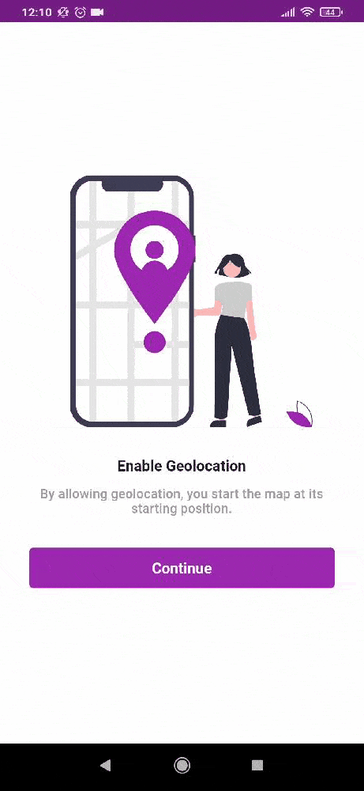

# 🗺 Location Selector App

Application that allows the user to select a location on the map dynamically and convert it into a readable address.




## 📝 Objective

First of all, this project was built to test the [Riverpod](https://riverpod.dev/docs/getting_started/) with [Flutter Hooks](https://pub.dev/packages/flutter_hooks) and how I could use them with a folder structure based on clean architecture concepts.

In addition, it was time to test how to use `--dart-define` to set environment variables and how to call it in native code, specially android.

## 📲 Getting Started

### Installing

**Cloning the Repository**

```
$ git clone https://github.com/gabrielvictorjs/location_selector_app.git

$ cd location_selector_app
```

**Installing dependencies**

```
$ flutter pub get
```

**Google Maps Settings**

* Get an API key at https://cloud.google.com/maps-platform/. 
* Enable Google Map SDK for each platform and enable Geocoding API.

**Running**

```
$ flutter run --dart-define GOOGLE_MAPS_KEY=<Your Google Maps Key>
```

## ⚙ Build With

Flutter SDK v1.22.6

- [Flutter Hooks](https://pub.dev/packages/flutter_hooks) Object that manages a `Widget` life-cycles
- [Hooks Riverpod](https://pub.dev/packages/hooks_riverpod) State and dependency manager
- [Dartz](https://pub.dev/packages/dartz) Functional programing elements in dart
- [Equatable](https://pub.dev/packages/equatable) Equality comparison simplifier
- [Freezed](https://pub.dev/packages/freezed) Code generator for unions/pattern-matching/copy
- [Dio](https://pub.dev/packages/dio) Http client for Dart
- [Google Maps Flutter](https://pub.dev/packages/google_maps_flutter) Google map `Widget`
- [Geolocator](https://pub.dev/packages/geolocator) Geolocation plugin
- [Flutter Svg](https://pub.dev/packages/flutter_svg) SVG rendering